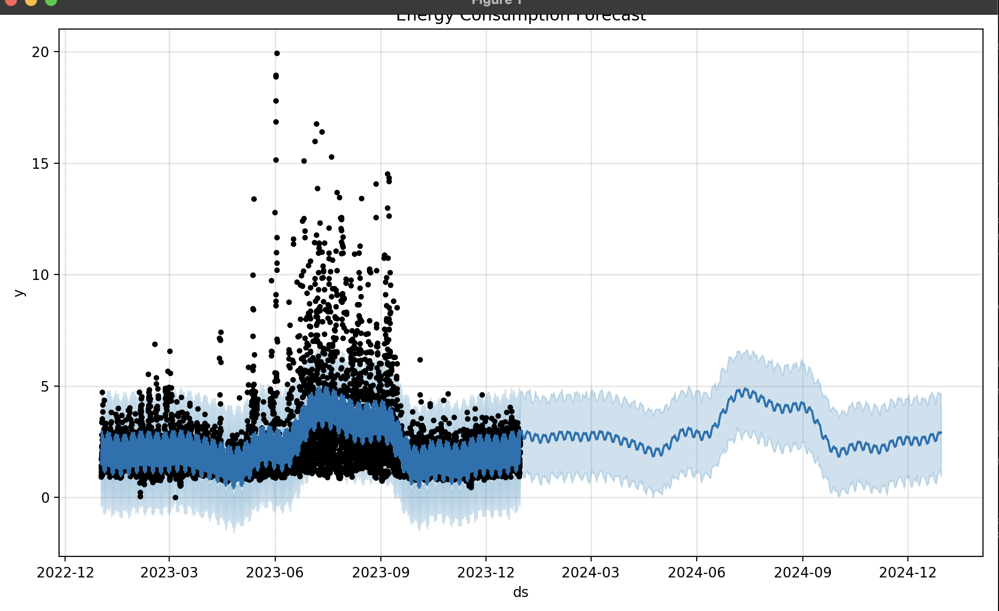
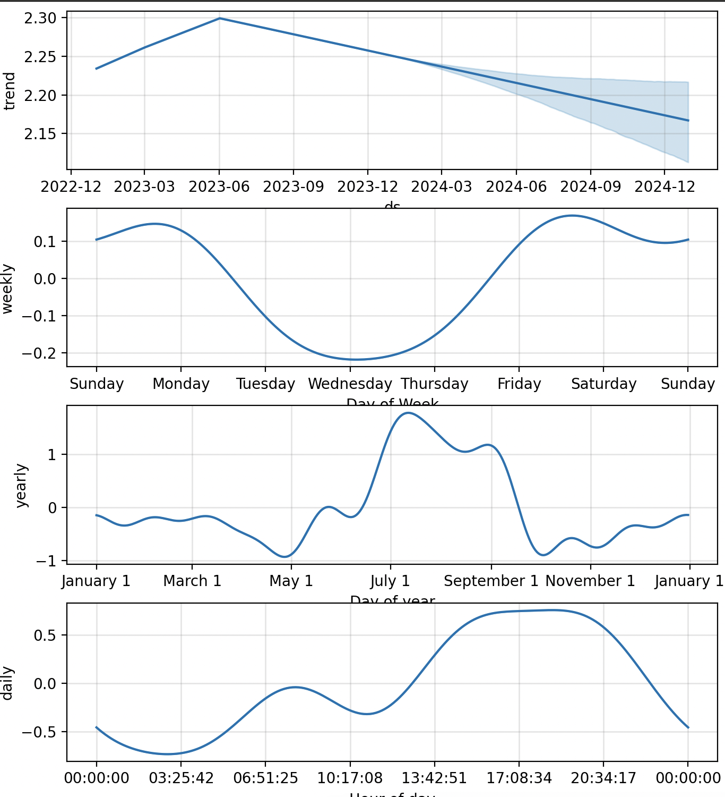

# Energy Consumption Forecasting with Prophet
<div align="center">

</div>
This repository contains the code and datasets used for forecasting energy consumption based on data from Sense.com using Facebook's Prophet time series forecasting tool. The project focuses on predicting future energy consumption based on historical data gathered from Sense.com's smart energy monitoring devices.

## Project Overview

The main goal of this project is to provide accurate forecasts of energy consumption using data from Sense.com. By analyzing historical consumption data from various devices monitored by Sense.com, this project aims to predict future energy usage, which can be critical for efficient energy management, cost reduction, and understanding consumption patterns. The forecasting model is built using the Prophet library, designed to handle time series data with daily or sub-daily observations.

<div align="center">

  
</div>

# Energy Consumption Forecasting Application

## Overview
This Flask application provides energy consumption forecasting using the Prophet model. It allows users to upload actual energy consumption data and compare it with forecasted data.

## Features
- Forecast energy consumption based on historical data.
- Upload actual energy consumption data via API.
- Compare forecasted data with actual data visually.

## Installation
To set up the application, follow these steps:
1. Clone the repository: `git clone [repository-url]`
2. Install dependencies: `pip install -r requirements.txt`
3. Run the application: `flask run`

## Usage
To use the application:
 - Navigate to `http://localhost:5000`.

To use the API:
- Endpoint: `/api/upload_actuals`
- Method: POST
- Data: File upload with actuals data

## API Example
Using `curl`:
```bash
curl -X POST http://localhost:5000/api/upload_actuals \
-F "file=@/path/to/your/actuals.csv" \
-F "date=2023-01-01" \
-F "range=day"
```


Authors

Don Dayley - Initial work - jddayley


License

This project is licensed under the MIT License - see the LICENSE.md file for details.

Acknowledgments
